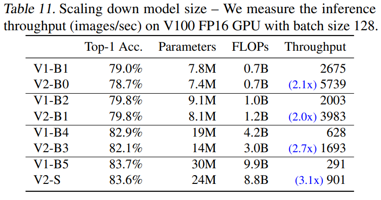

# Automatic Image Mining

In the [previous](https://blog.qwertyforce.dev/posts/similar_image_search) [articles](https://blog.qwertyforce.dev/posts/photo_gallery_with_image_search), we established how to build a photo gallery with its own search engine. But where do we find the images we like? We need to manually find sources of "good" images and then manually check if an image is "good". Can we automate both of these tasks? And the answer is yes.

# Outlier detection
"Many applications require being able to decide whether a new observation belongs to the same distribution as existing observations (it is an inlier), or should be considered as different (it is an outlier). Often, this ability is used to clean real data sets. Two important distinctions must be made:" 

<table width="100%">

  <tr>
    <td width="20%">outlier detection</td>
    <td width="80%">The training data contains outliers which are defined as observations that are far from the others. Outlier detection estimators thus try to fit the regions where the training data is the most concentrated, ignoring the deviant observations.</td>
  </tr>
  <tr>
    <td width="20%">novelty detection</td>
    <td width="80%">The training data is not polluted by outliers and we are interested in detecting whether a <b>new</b> observation is an outlier. In this context an outlier is also called a novelty.</td>
  </tr>
</table>

(https://scikit-learn.org/stable/modules/outlier_detection.html)  

Novelty detection seems promising - we can gather a dataset of images we like, train a novelty detection algorithm, and for each new image test if it's "good" for us.
There are a lot of anomaly detection algorithms, but I decided to go with Gaussian Mixture Model, because it's quite fast and doesn't require holding training dataset in memory, like k-nn based algorithms (for example, [LOF](https://en.wikipedia.org/wiki/Local_outlier_factor)).  
btw, I found this wonderful library, [PyOD](https://pyod.readthedocs.io/en/latest/), which implements a lot of anomaly detection algorithms.
<!-- https://aabkn.github.io/GMM_visually_explained -->

# GMM
Image features are extracted with CLIP, because it's awesome and I use it everywhere.  
n_components was found through trial and error.
```python
from sklearn.mixture import GaussianMixture
gmm = GaussianMixture(n_components = 16, covariance_type = 'full')
gmm.fit(features)
```
After that we can score samples, where score is log-likelihood of each sample.
```python
gmm.score_samples(features)
```
This is the histogram of scores of training(clean) dataset (x is gmm score)
  

and this is the histogram of scores of unfiltered dataset (/r/EarthPorn/). Scores are clipped at 0 and -3000 for better visibility.

  

Now we can choose a threshold. Lower threshold ⇒ more images, more outliers and vice versa.

# Watermark detection

Unfortunately, the presence of watermarks doesn't have much effect on GMM score. So, I've trained a binary classifier (no_watermark/watermark). I've annotated 22k images and uploaded the dataset to [kaggle](https://www.kaggle.com/datasets/qwertyforce/scenery-watermarks).  
I've found that downscaling image to 224x224 erases subtle watermarks, so I've decided to resize images to 448x448, get features of each 224x224 quadrant and concatenate them. Accuracy is about 97-98%, but there are still false-negatives. Probably need a bigger and more diverse dataset.  
Pic - plot of losses, blue - train split, orange - test split.  
  

## Update 22.05.2023
Previous solution (using clip for watermark detection) consumed a lot of VRAM and getting clip features for each quadrant is pretty slow. So I've decided to fine-tune a separate network for this task. I've chosen a pretrained [EfficientNetV2-B0](https://arxiv.org/pdf/2104.00298.pdf).

  

Accuracy of the new model is a little bit higher, due to higher resolution (I've trained with 512x512).
I've also converted new watermark detection model and clip model to onnx. This enables low-ram cpu inference. I had to rewrite some pre-processing steps in numpy, like image normalization and standardization. 

The new model can be found at anti_sus github repo and [hugging face](https://huggingface.co/qwertyforce/watermark_detection)

# anti_sus  
[[Github]](https://github.com/qwertyforce/anti_sus)  
anti_sus is a zeromq server for filtering outlier images. It receives a batch of rgb images (numpy array) and returns indexes of good images.
It has 2 step filtering:
- gmm score threshold
- watermark detection  

In the future, I'd like to add models that can evaluate the image quality ([IQA](https://en.wikipedia.org/wiki/Image_quality#:~:text=The%20process%20of%20determining%20the%20level%20of%20accuracy%20is%20called%20Image%20Quality%20Assessment%20(IQA).)) and detect if an image is synthetic aka generated with GANs or Diffusion models. 

# nomad
[[Github]](https://github.com/qwertyforce/nomad)  
nomad is as super hacky reddit parser that uses [Pushshift](https://pushshift.io/) API to get new posts from reddit. Supports flickr and imgur image download.
## Update 22.05.2023
Reddit [killed](https://www.reddit.com/r/modnews/comments/134tjpe/reddit_data_api_update_changes_to_pushshift_access/) Pushshift, so nomad is switched to official reddit api.
# Results
154 images in ~14 hours, with threshold of 700.  
  
Top 15 subreddits:
```python
[('u_Sovornia', 15),
 ('itookapicture', 5),
 ('EarthPorn', 5),
 ('Outdoors', 3),
 ('fujifilm', 3),
 ('flyfishing', 2),
 ('Washington', 2),
 ('sunset', 2),
 ('travelpictures', 2),
 ('RedDeadOnline', 2),
 ('SonyAlpha', 2),
 ('iPhoneography', 2),
 ('SkyPorn', 1),
 ('MaldivesHoliday', 1),
 ('natureisbeautiful', 1)]
```
We can see that we get a pretty diverse list of subreddits. If we let it run for a while, we'll get a list of subreddits that are similar to our interests, and we can parse them individually.

# Integration with scenery
We can use this combination of nomad+anti_sus in two different ways: we can use it as a standalone tool and just save new images to the file system, or we can integrate it with scenery. This way, new images will be added to our photo gallery automatically, and we can use ambience to check if an image is a duplicate. At the time of writing, it's preferred to use phash, I am currently researching the possibility of making use of local features from local_features_web, but it's too memory/computationally expensive. Why not just use CLIP features? Too unreliable, lots of errors  
  

#
btw I cleaned /r/Earthporn/ and it's on [scenery.cx](https://scenery.cx/) now.

If you found any inaccuracies or have something to add, feel free to submit PR or raise an issue.